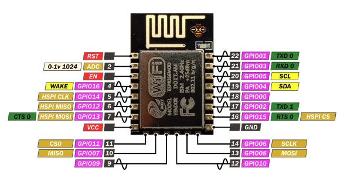
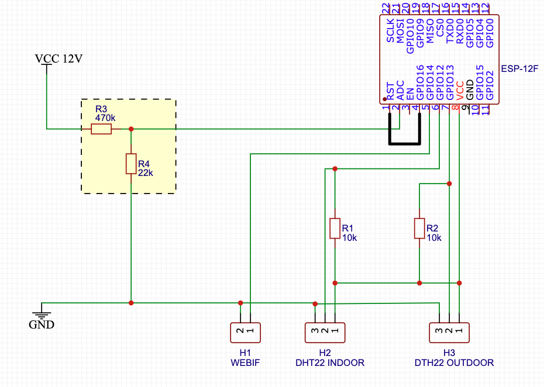

# tauPau
Dieses Projekt realisiert ein autarkes 12V Taupunkt-Lüftungssystem für die Garage auf ESP8266-Basis

## Beschreibung
**! In Arbeit !**  
Die Luftfeuchtigkeit in einer Garage sollte zwischen 50 und 55 % betragen. Nur dann kann ist sichergestellt, dass Fahrzeuge und alles Andere trocken bleiben. Ab ca. 70 % Luftfeuchtigkeit kann es zu Feuchtigkeitsschäden, wie z.B. Schimmelbildung, kommen.

Ziel ist ein preiswertes, stromsparendes System zur automatischen Lüftung einer Garage aufzubauen. Da meine Garage nicht über einen eigenen Stromanschluss verfügt, soll das System mit einer 12V Autobatterie versorgt werden. Als Basis wird ein Relaisboard mit verbauten ESP8266 verwendet, da dies relativ günstig zu haben ist und bereits wesentliche Komponenten wie die Spannungsregelung, Relais, etc mitbringt.
Der WLAN-Teil des ESP soll aus Stromspar- sowie Sicherheitsgründen im Normalbetrieb deaktiviert sein und nur zur Diagnose sowie zum OTA-Update manuell eingeschaltet werden können.

****

## Teileliste
* ESP8266 auf Relaisboard incl. Spannungswandler
* 12V Fan
* 2x DHT22
* 2x Widerstände (Pullup)
* 2x Schalter (Fan On/Off, Wlan)
* KFZ Batterie
* Kabel, Stecker, ...
 
## Hardwareaufbau
### Schaltplan
TODO: Bild des Schaltplan

### Umbau des Relaisboards

Das Relaisboard verfügt über einen ESP 8266MOD mit folgendem Pinout:
  

**Im Relaisboard verwendete GPIOs**  
GPIO 05 - Switch Automatik On/Off  
GPIO 04 - Relay
GPIO 00 - Boot  
GPIO 01 - TXD  
GPIO 03 - RXD

**Neu zu verdrahtende GPIOs**  
GPIO 16 - DeepSleep Wakeup  
GPIO 14 - Switch WebUI/Wifi  
GPIO 12 - DHT22 INDOOR  
GPIO 13 - DHT22 OUTDOOR  

 

R3 & R4 Batteriewächter, Spannungsteiler zum Herunterregeln der 12V Spannung auf den ADC -Bereich des ESP  
R1 & R2 Pull-Up Widerstände für die DHT22 Sensoren  
RST-GPIO16-Brücke - DeepSleep, WakeUp via GPIO16 

TODO: Bild des Umbaus

### DHT22

## Software
### Konfiguration

| Name                           | Beschreibung                            | Standard |
| :---                           |    :---                                 | ---:     |
| offset_temperature_indoor      | Temperaturausgleich (Innen)             | 0.0      |
| offset_humidity_indoor         | Feuchtigkeitsausgleich (Innen)          | 0.0      |
| offset_temperature_outdoor     | Temperaturausgleich (Außen)             | 0.0      |
| offset_humidity_outdoor        | Feuchtigkeitsausgleich (Außen)          | 0.0      |
| min_temperature_indoor         | Minimal Temperatur (Innen)              | 8.0      |
| min_temperature_outdoor        | Minimal Temperatur (Außen)              | 0.0      |
| max_humidity_outdoor           | maximal Feuchtigkeit (Außen)            | 70.0 %   |
| min_humidity_indoor            | minimal Feuchtigkeit (Innen)            | 50.0 %   |
| threshold_dewpoint_on          | Einschalt-TaupunktDelta-Schwellwert     | 5.0      |
| threshold_dewpoint_off         | Ausschalt-TaupunktDelta-Schwellwert     | 1.0      |
| sleeptime_ms_fan_on            | MCU Sleeptime (Aktiver Lüfter)          | 5 min    |
| deepsleeptime_ms_fan_off       | MCU DeepSleeptime (Inaktiver Lüfter)    | 30 min   |
| min_voltage                    | Minimale Versorgungsspannung            | 12.4 V   |
| voltage_correction_factor      | Korrekturwert für Spannungsmessung      | 1.0      |

### Einspielen der Firmware
### WebUI-Endpoints
| Endpoint                       | Beschreibung                            |
| :---                           |    :---                                 |
| http://IPAddress/              | Webinterface                            |
| http://IPAddress/status        | Sensor & Schaltungsdaten (JSON)         |
| http://IPAddress/config        | EEPROM Parameter (JSON)                 |
| http://IPAddress/sysinfo       | MCU Infos                               |
| http://IPAddress/update        | OTA-Update Page                         |

## Offen / Ideen
* Gehäuse (ggf.3D Druck, STL)
* Ausbau der Fehlertolleranz (zu geringe Spannung, ungültige Signale, HW Fehler, ...)
* Automatikkonfiguration via WebUI anpassen

## Quellen/ Weitere Informationen
**ESP8266**  
[ESP8266 Pinout]: https://randomnerdtutorials.com/esp8266-pinout-reference-gpios  
[ESP8266 und DeepSleep]: https://randomnerdtutorials.com/esp8266-deep-sleep-with-arduino-ide/  
[ESP8266 und DHT22]: https://randomnerdtutorials.com/esp8266-dht11dht22-temperature-and-humidity-web-server-with-arduino-ide/  
[ESP8266 EEPROM]: https://arduino.stackexchange.com/questions/25945/how-to-read-and-write-eeprom-in-esp8266  

**ähnliche Projekte**  
[Arduino Projekt]: http://gemander.org/2017/02/11/arduino-kellerentfeuchtung-mit-arduino-und-dht22/  
[Heise Make Magazin]: https://github.com/MakeMagazinDE/Taupunktluefter  

**Taupunktsteuerung**  
[Taupunktrechner]: https://www.corak.ch/service/taupunkt-rechner.html  
[Taupunktrechner + Formel]: https://www.wetterochs.de/wetter/feuchte.html  

